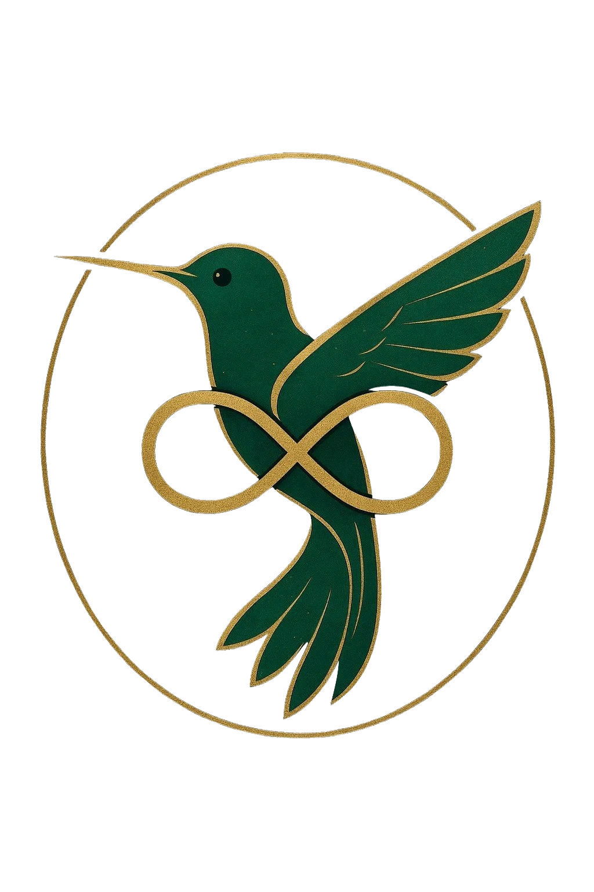

# Byrd Consulting Group - Opportunities Website

A dynamic, responsive website showcasing 10 strategic AI-powered business solutions from Byrd Consulting Group. Built with React, TypeScript, and Tailwind CSS.



## 🌟 Features

- **10 Strategic Opportunities**: Comprehensive pages for each AI solution
- **Responsive Design**: Optimized for mobile, tablet, and desktop
- **Pre-loader Animation**: Branded loading experience with logo animation
- **Green Color Scheme**: Professional brand colors (#2D5F3F, #3D7F5F, #7FD858, #FFD700)
- **Appointment Integration**: Direct booking links to consultation scheduling
- **SEO Optimized**: Meta tags and semantic HTML
- **Smooth Animations**: Transitions, hover effects, and scroll behaviors

## 🚀 Live Demo

**Website**: [View Live Site](https://3000-iuebarudpcmbzqo3ndle7-7acab81d.manus.computer)

## 📋 Opportunities Showcased

1. **Cedar AI** - Cannabis Operations Powerhouse
2. **Hope AI** - Foundation & Non-Profit Portal
3. **PIP Framework** - Performance Intelligence Platform
4. **Genesis Manufacturing System** - Autonomous Factory Ecosystem
5. **VerdantStar** - Revolutionary Energy Intelligence Platform
6. **Evergreen Detroit** - Integrated Urban Development
7. **Evergreen Agricultural Solutions** - Advanced Agricultural Intelligence
8. **Evergreen Investments** - Human-Computer Interface Revolution
9. **DREAM Engineering** - Infrastructure & AI Integration
10. **Strategic AI Integration** - Tailored Systems for Sustainable Growth

## 🛠️ Tech Stack

- **Frontend**: React 19 + TypeScript
- **Styling**: Tailwind CSS 4 + shadcn/ui
- **Routing**: Wouter
- **Build Tool**: Vite
- **Icons**: Lucide React
- **Deployment**: Manus Platform

## 📁 Project Structure

```
byrd-opportunities-site/
├── client/
│   ├── public/
│   │   ├── byrd-logo.png          # Transparent logo
│   │   └── images/                # Opportunity images (30 PNGs)
│   ├── src/
│   │   ├── components/
│   │   │   ├── Navigation.tsx     # Header navigation
│   │   │   ├── Footer.tsx         # Footer component
│   │   │   ├── Preloader.tsx      # Loading animation
│   │   │   └── OpportunityCard.tsx # Opportunity cards
│   │   ├── pages/
│   │   │   ├── Home.tsx           # Homepage
│   │   │   └── OpportunityDetail.tsx # Individual opportunity pages
│   │   ├── data/
│   │   │   └── opportunities.ts   # Opportunity data
│   │   ├── App.tsx                # Main app component
│   │   └── index.css              # Global styles
│   └── index.html
├── todo.md                         # Project tracking
└── README.md                       # This file
```

## 🎨 Design System

### Color Palette
- **Primary Green**: `#2D5F3F`
- **Medium Green**: `#3D7F5F`
- **Bright Green**: `#7FD858`
- **Accent Gold**: `#FFD700`
- **Dark Background**: `#0A1F1A`

### Typography
- **Font**: Inter (Google Fonts)
- **Headings**: Bold, 600-900 weight
- **Body**: Regular, 400 weight

### Responsive Breakpoints
- **Mobile**: < 768px
- **Tablet**: 768px - 1024px
- **Desktop**: > 1024px

## 🚀 Getting Started

### Prerequisites
- Node.js 22.x or higher
- pnpm (recommended) or npm

### Installation

1. Clone the repository:
```bash
git clone https://github.com/stampedehosting/byrd-opportunities-website.git
cd byrd-opportunities-website
```

2. Install dependencies:
```bash
pnpm install
```

3. Start development server:
```bash
pnpm dev
```

4. Open browser to `http://localhost:3000`

### Build for Production

```bash
pnpm build
```

The production-ready files will be in the `client/dist` directory.

## 📸 Screenshots

### Homepage
- Hero section with tagline "Grounded Wisdom. Elevated Outcomes."
- Statistics showcase (50+ Organizations, 35% Cost Reduction, 25% Efficiency Gains)
- Opportunities grid with 10 cards

### Opportunity Pages
- Detailed information for each solution
- Key features and benefits
- Target audience and use cases
- Call-to-action buttons for consultation booking

### Pre-loader
- Animated bird logo with pulse effect
- "BYRD" text in bright green
- Loading spinner
- "Loading Opportunities..." message

## 🔗 Important Links

- **Appointment Booking**: https://www.byrdconsulting.group/appointments
- **Company Website**: https://byrdconsultinggroup.ai
- **GitHub Repository**: https://github.com/stampedehosting/byrd-opportunities-website

## 📦 Additional Deliverables

This project includes comprehensive marketing materials:

- **30 PNG Images** (3 per opportunity) for social media
- **10 Professional PDFs** (one per opportunity)
- **60 Video Prompts** (10 InVideo + 50 social media)
- **1 Infographic** showing all opportunities
- **AI Agent Knowledge Base** for chatbot implementation

All deliverables are available in the project package.

## 🤝 Contributing

This is a client project for Byrd Consulting Group. For contributions or modifications, please contact the development team.

## 📄 License

© 2025 Byrd Consulting Group. All rights reserved.

## 🙏 Acknowledgments

- **Design & Development**: Manus AI Platform
- **Client**: Byrd Consulting Group
- **Tagline**: "Grounded Wisdom. Elevated Outcomes."
- **Core Value**: "Clarity is the First Form of Capital."

---

**Built with ❤️ by Manus AI**

For questions or support, visit [Byrd Consulting Group](https://byrdconsultinggroup.ai)
